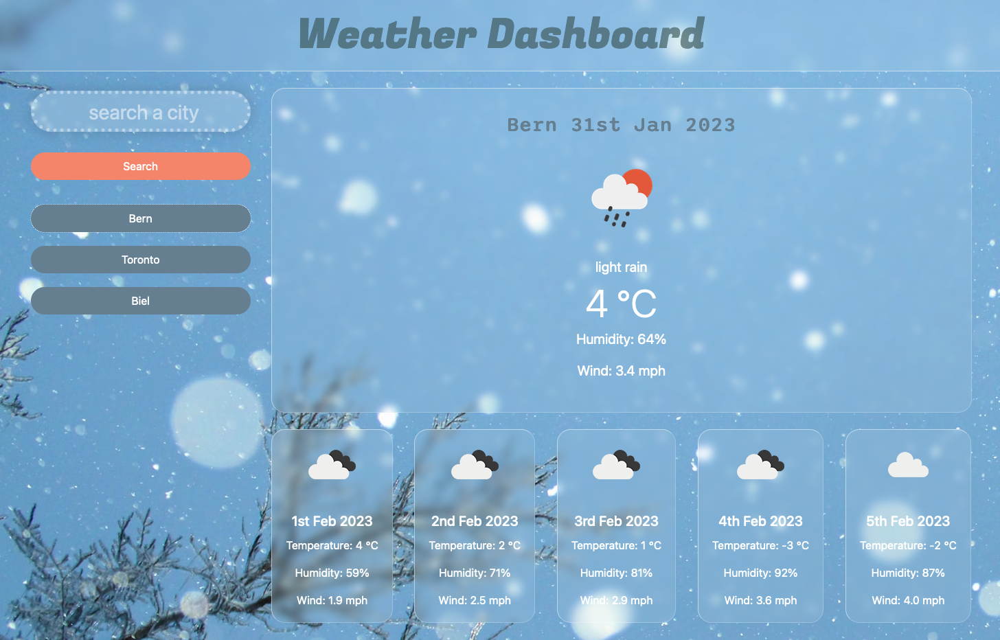

# Weather Dashboard
This weather app allows users to search for and view current and future weather conditions for cities around the world. The app utilizes the OpenWeatherMap API to retrieve weather data and display it to the user in an easy-to-read format. The app also includes a feature for saving and viewing past city searches for easy access to frequently checked weather conditions.

## How to Use
Enter the name of a city into the search bar and click the search button.
The current weather conditions for that city will be displayed, including the temperature, humidity, and wind speed.
Five-day forecast for that city will also be displayed, including an icon representing the weather conditions, the temperature and humidity for each day.
Previous city searches will be saved and displayed as buttons, allowing for easy access to frequently searched cities.
## Technologies Used
* JavaScript
* jQuery
* moment.js
* OpenWeatherMap API
* HTML
* CSS
## Screenshot

## Deployment
https://aloosli.github.io/Weather-Dashboard/

